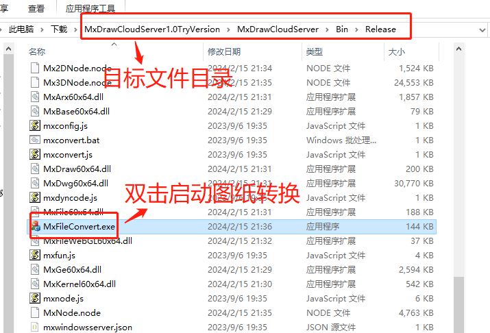

## Open CAD drawing

mxdraw.js can not only open the canvas drawing, but also open the CAD drawing for simple preview annotation. In API 'Mx.MxFun.createMxObject()', a property 'cadFile' is provided that can open CAD drawings. Users can set the path of CAD drawings through this property, where the CAD drawings can be read only after the file format is converted with the help of MxDraw cloud graphics development kit. For details, please refer to [Drawing conversion](#图纸转换)。

```html
<div style="height: 80vh; overflow: hidden;">
  <canvas id="mxcad"><canvas>
<div>
```

```js
// Dynamic loading of js library core code
Mx.loadCoreCode().then(()=> {
  // Create a control object
  Mx.MxFun.createMxObject({
      canvasId: "mxdraw", // id of the canvas element
      // The converted file is composed of multiple.wgh files, but we only need to get the prefix to access it.
      // For example:... /.. /demo/buf/$hhh.dwg we can directly write cadFile: ".. /.. /demo/buf/hhhh.dwg"
      // Converted file
      cadFile: "../../demo/buf/hhhh.dwg",
  })
})
```
## Drawing conversion

Since CAD drawings can not be directly browsed online, it is necessary to use MxDraw cloud map development kit to convert into a file format that can be browsed online, the specific steps are as follows:

(For more detailed instructions on the use of the development kit, please refer to [Mxdraw cloud image documentation](https://help.mxdraw.com/?pid=32))

### # Step 1: Download Mxdraw cloud map development kit

MxDraw cloud map development kit provides the exe program for drawing conversion (support window and linux versions), including a variety of supporting services (such as node back-end development related source code, drawing information extraction and front-end of various sample source code), In the official website to download the latest version of the [Mxdraw cloud development kit](https://www.mxdraw.com/download.html).

Download the file directory after the Mxdraw cloud image development package is decompressed:


### The second step calls MxFileConvert.exe to start the drawing conversion

Look for the MxFileConvert.exe application in the folder directory where it was extracted and double-click to launch it. The converted target CAD files are converted into multiple dwg files and stored in a folder named buf.




After the file format is successfully converted, a buf folder containing multiple dwg files is obtained and saved in the directory where the target file is located.


### The third step web rendering display

We can read CAD drawings through Mx.MxFun.createMxObject.

## Other conversion methods

### windows system

Open cmd, start the command line to go to the directory where MxFileConvert.exe resides, and then invoke the command: MxFileConvert.exe "C:/test.dwg", where "C:/test.dwg" indicates the location of the target file to be converted. After the call is complete, the drawing conversion is successful only if the command line output '{"code":0,"message":"ok"}'. The converted file is saved in the buf folder in the same directory as the target file. Example code is as follows:

```sh

cd C:\MxDrawCloudServer1.0TryVersion\MxDrawCloudServer\Bin\Release

MxFileConvert.exe "C:/test.dwg"

```
### linux system

After finding the development package directory 'Bin\Linux\Bin', run the command to copy the file in the directory to the Linux system, and then run the following command to increase the execution permission of the file:

```sh
su root
chmod -R 777 *
cp -r ./mx /mx
chmod -R 777 /mx/*
./node mxconvert.js 1.dwg
```

The converted file is in the Bin\Linux\Bin\buf directory

<demo :url="$withBase('/samples/start/quickStart.html')" />   