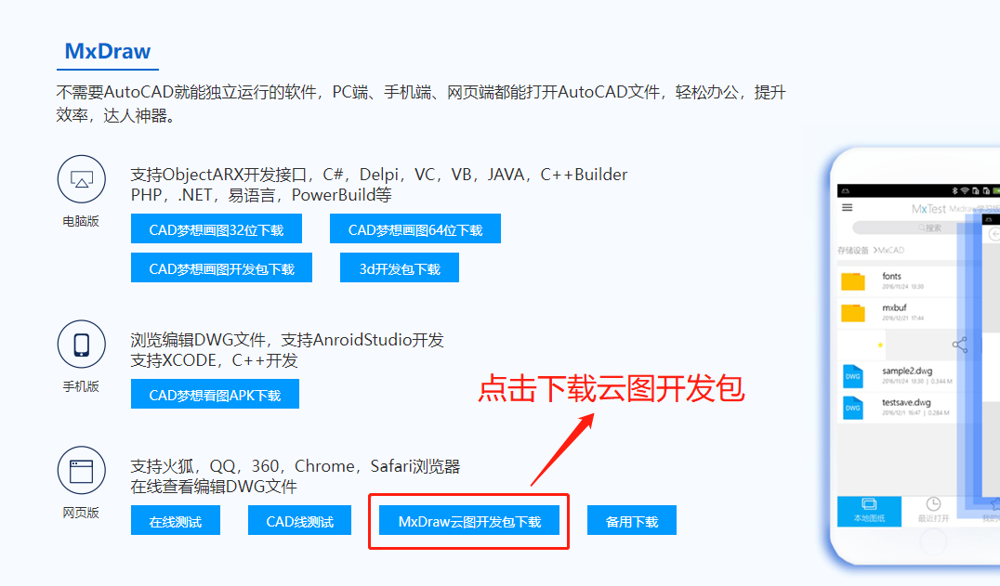
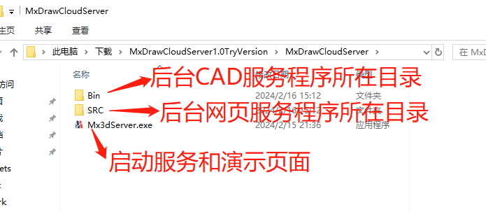
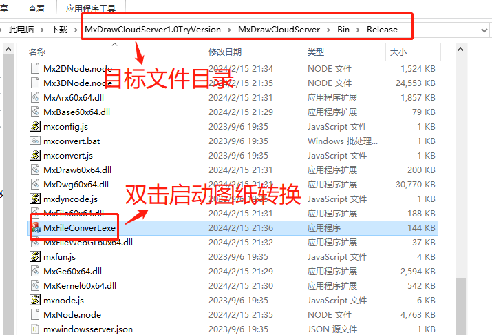
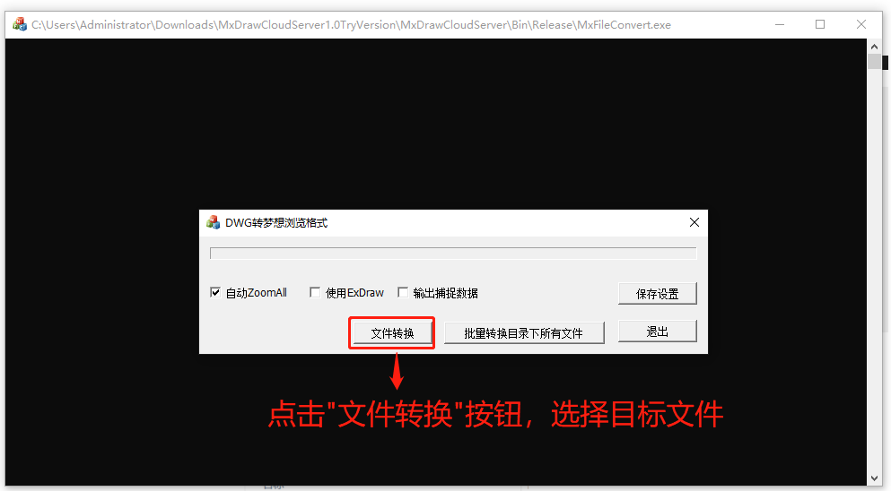

## 打开CAD图纸

mxdraw.js不仅能够打开画布绘图，还能打开CAD图纸进行简单的预览标注。在API`Mx.MxFun.createMxObject()`中提供了可打开CAD图纸的属性`cadFile`，用户可通过该属性设置CAD图纸路径，其中，该CAD图纸需要借助MxDraw云图开发包转换文件格式后才能被读取。具体操作请参考[图纸转换](#图纸转换)。

```html
<div style="height: 80vh; overflow: hidden;">
  <canvas id="mxcad"><canvas>
<div>
```

```js
// 动态加载 js库核心代码
Mx.loadCoreCode().then(()=> {
  // 创建控件对象
  Mx.MxFun.createMxObject({
      canvasId: "mxdraw", // canvas元素的id
      // 转换后的文件是多个.wgh的文件构成， 但是我们只需要得到前缀，就可以访问，
      // 比如:../../demo/buf/$hhhh.dwg 我们可以直接写成cadFile: "../../demo/buf/hhhh.dwg"
      // 转换后的文件
      cadFile: "../../demo/buf/hhhh.dwg",
  })
})
```
## 图纸转换

由于CAD图纸无法直接被在线浏览，因此需要借助MxDraw云图开发包来转换成可被在线浏览的文件格式，具体操作步骤如下：

(更详细开发包使用说明请参考[Mxdraw云图文档](https://help.mxdraw.com/?pid=32))

### 第一步:下载Mxdraw云图开发包

MxDraw云图开发包中提供了图纸转换的exe程序(支持 window 和linux 版本)，包含了各种配套服务(如node 后端开发相关源码、图纸信息提取 以及前端的各种示例源码)，可在官网下载最新版本的[Mxdraw云图开发包](https://www.mxdraw.com/download.html)。

下载Mxdraw云图开发包解压后的文件目录：


### 第二步 调用MxFileConvert.exe启动图纸转换

在解压后的文件夹目录下找MxFileConvert.exe应用程序并双击启动。经过转换的目标CAD文件变为多个dwg格式的文件并统一保存在名为buf的文件夹中。





成功转换文件格式后，得到含有多个dwg文件的buf文件夹，并保存在目标文件所在的目录下。


### 第三步 网页渲染展示

我们可以通过Mx.MxFun.createMxObject读取CAD图纸。

## 其他转换方式

### windows系统

打开cmd，启动命令行进入MxFileConvert.exe所在的目录后，再调用命令：MxFileConvert.exe "C:/test.dwg"，其中"C:/test.dwg"为需要转换格式的目标文件所在位置。调用结束后，只有当命令行输出'{"code":0,"message":"ok"}'才表示图纸转换成功。转换后的文件保存在目标文件所在的目录下的buf文件夹中。示例代码如下：

```sh

cd C:\MxDrawCloudServer1.0TryVersion\MxDrawCloudServer\Bin\Release

MxFileConvert.exe "C:/test.dwg"

```
### linux系统

找到开发包目录`Bin\Linux\Bin`后，运行命令把该目录下的文件拷到 Linux系统上，再执行如下命令，增加文件的执行权限：

```sh
su root
chmod -R 777 *
cp -r ./mx /mx
chmod -R 777 /mx/*
./node mxconvert.js 1.dwg
```

转换后的文件在`Bin\Linux\Bin\buf`目录下

<demo :url="$withBase('/samples/start/quickStart.html')" />   